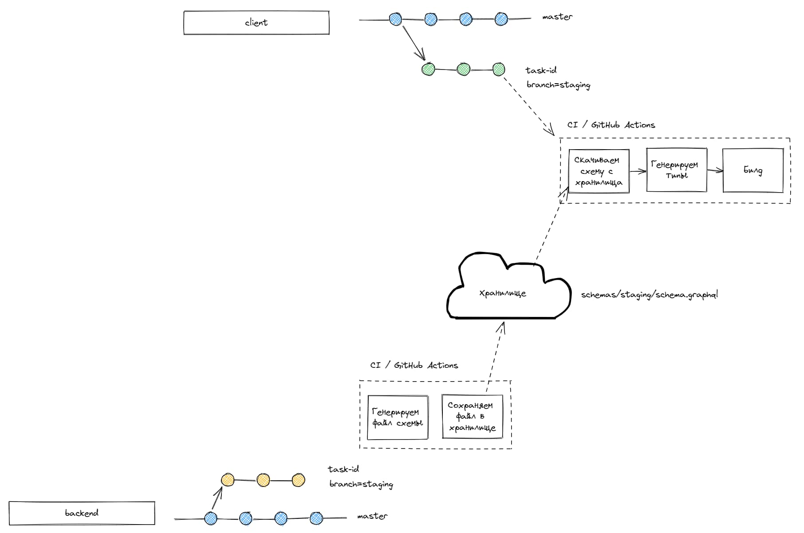

## Флоу CI
- При создании ПР с базовой веткой `staging` или `master` или пуше в эти ветки запускается воркфлоу Github Actions
- Если ветка `master` или `staging` -> скачиваем файл схемы в соответсвии с ветками, также указываем `API_URL`.
- Если ветка отличная от вышеуказанных -> скачиваем файл для окружения по умолчанию (`staging`) - `API_URL` также для стейджинга.
- Кодогенерация
- Билд

Переменные лежат в секретах репозитория.

Хранилище - firebase storage.

## Установка зависимостей

```sh
npm ci
```

## Скачивание схемы и кодогенерация

При запуске команды скрипт:

- Скачает файл `schema.graphql` из хранилища
- Окружение для которой скачивается схема указана в переменной окружения `BRANCH`. Переменная заполнятеся с учетом ветки.
- `graphql-codegen` генерирует необходимые типы и хуки на основе скачанной схемы

```sh
npm run codegen
```

## Запуск в режиме разработки

```sh
npm run dev
```
## Общая схема CI
